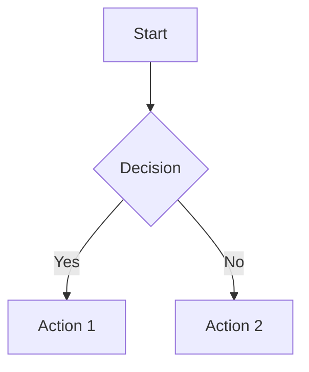
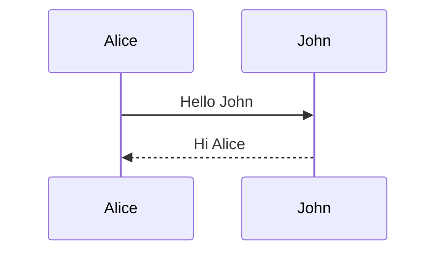

# Slidev Presentation Skill

Create professional developer presentations using [Slidev](https://sli.dev/) with the Nord theme.

## What is Slidev?

Slidev is a Markdown-based slide maker for developers. You write slides in a single `slides.md` file using Markdown, frontmatter, and Vue components. It supports code highlighting, animations, LaTeX, Mermaid diagrams, icons, and more — all rendered in a browser via Vite.

## Quick Start — Scaffold a New Presentation

All presentations live in `~/Documents/presentations/`. When the user asks for a presentation, create a new project directory and scaffold it:

1. Create the directory at `~/Documents/presentations/<kebab-case-name>/`
2. Write `package.json` with the content below
3. Run `pnpm install` to install dependencies
4. Create `style.css` with the default column gap styles below
5. Write `slides.md` with the presentation content
6. Tell the user to run `pnpm dev` to preview

### package.json

```json
{
  "name": "presentation-name",
  "type": "module",
  "scripts": {
    "dev": "slidev --open",
    "build": "slidev build",
    "export": "slidev export"
  },
  "dependencies": {
    "@slidev/cli": "^52.12.0",
    "slidev-theme-nord": "^0.0.6",
    "vue": "^3.5.27"
  },
  "pnpm": {
    "onlyBuiltDependencies": ["esbuild"]
  }
}
```

### style.css

Create `style.css` in the project root (next to `slides.md`). Slidev automatically loads this file as a global stylesheet.

```css
.two-columns,
.two-cols-header {
  column-gap: 2rem;
}
```

**Important:** The `two-cols` layout uses the CSS class `.two-columns` (not `.two-cols`). The `two-cols-header` layout uses `.two-cols-header`. Always create this file when scaffolding — the default gap is too tight.

## Core Syntax Reference

### Slide Separators

Slides are separated by `---` on its own line (with content before and after):

    # Slide 1

    Content here

    ---

    # Slide 2

    More content

### Global Headmatter (First Slide Only)

The very first block between `---` markers configures the entire presentation. This is YAML frontmatter:

    ---
    theme: nord
    layout: center
    class: text-center
    title: My Presentation
    author: Name
    transition: slide-left
    hideInToc: true
    ---

Key headmatter properties:

| Property      | Description                        | Default  |
| ------------- | ---------------------------------- | -------- |
| `theme`       | Theme package name                 | —        |
| `title`       | Presentation title                 | —        |
| `author`      | Author name (for PDF export)       | —        |
| `layout`      | Default layout for first slide     | `cover`  |
| `class`       | CSS classes for first slide        | —        |
| `transition`  | Default slide transition           | —        |
| `aspectRatio` | Slide aspect ratio                 | `'16/9'` |
| `canvasWidth` | Canvas width in pixels             | `980`    |
| `lineNumbers` | Show line numbers in code blocks   | `false`  |
| `fonts`       | Google Fonts configuration         | —        |
| `hideInToc`   | Hide this slide from TOC           | —        |
| `defaults`    | Default frontmatter for all slides | —        |

### Per-Slide Frontmatter

Each slide can override settings with its own frontmatter block:

    ---
    layout: two-cols
    class: text-center
    transition: fade
    hideInToc: true
    ---

Per-slide properties: `layout`, `class`, `background`, `transition`, `clicks`, `disabled`, `hide`, `hideInToc`, `level`, `src`, `title`, `zoom`, `preload`.

### Presenter Notes

Add notes as HTML comments at the end of a slide:

    # My Slide

    Content here

    <!-- Speaker notes go here. **Markdown** works in notes. -->

### Named Slots

Use `::name::` markers to distribute content to layout slots:

    ---
    layout: two-cols
    ---

    # Left Column
    Content on the left

    ::right::

    # Right Column
    Content on the right

## Nord Theme Style Guidelines

Always use `theme: nord` in the headmatter. The Nord palette:

- **Polar Night** (backgrounds): `#2e3440`, `#3b4252`, `#434c5e`, `#4c566a`
- **Snow Storm** (text): `#d8dee9`, `#e5e9f0`, `#eceff4`
- **Frost** (accents): `#8fbcbb`, `#88c0d0`, `#81a1c1`, `#5e81ac`
- **Aurora** (highlights): `#bf616a` red, `#d08770` orange, `#ebcb8b` yellow, `#a3be8c` green, `#b48ead` purple

Style principles:

- Use `layout: center` with `class: text-center` for title and section dividers
- Keep slides clean — one idea per slide
- Use emoji sparingly for visual anchors in bullet lists
- Prefer short bullet points with **bold** key terms
- Use `<br>` for vertical spacing when needed

## Built-in Layouts

| Layout            | Use For                                | Slot Syntax                |
| ----------------- | -------------------------------------- | -------------------------- |
| `default`         | General content                        | —                          |
| `center`          | Title slides, section dividers, quotes | —                          |
| `cover`           | Opening slide                          | —                          |
| `intro`           | Introduction                           | —                          |
| `section`         | Section dividers                       | —                          |
| `statement`       | Bold single statements                 | —                          |
| `quote`           | Quotations                             | —                          |
| `fact`            | Key data points                        | —                          |
| `full`            | Edge-to-edge content                   | —                          |
| `end`             | Closing slide                          | —                          |
| `none`            | No styling                             | —                          |
| `image`           | Full-screen image                      | `image` prop               |
| `image-left`      | Image left, content right              | `image` prop               |
| `image-right`     | Image right, content left              | `image` prop               |
| `iframe`          | Embed a webpage                        | `url` prop                 |
| `iframe-left`     | Webpage left, content right            | `url` prop                 |
| `iframe-right`    | Webpage right, content left            | `url` prop                 |
| `two-cols`        | Two-column layout (no title)           | `::right::` separator      |
| `two-cols-header` | Title + two columns (preferred)        | `::left::` and `::right::` |

### Two-Column Layout Choice

- **Prefer `two-cols-header`** when the slide has a title/heading. It renders the title full-width above both columns, which looks cleaner and avoids wasting a column on a heading.
- **Use `two-cols`** only when there is no shared title and each column has its own independent heading.

### Two-Column Example (with title — use `two-cols-header`)

    ---
    layout: two-cols-header
    ---

    # Request vs Response

    ::left::

    ```python
    @app.post("/users")
    async def create_user(
        user: UserCreate,
    ):
        return save(user)
    ```

    ::right::

    ```json
    {
      "id": 1,
      "name": "Alice",
      "email": "alice@example.com"
    }
    ```

### Two-Column Example (no shared title — use `two-cols`)

    ---
    layout: two-cols
    ---

    # Left Side

    - Point A
    - Point B

    ::right::

    # Right Side

    - Point C
    - Point D

### Image Layout Example

    ---
    layout: image-right
    image: /architecture.png
    ---

    # System Architecture

    The system consists of three main components...

## Code Blocks

### Basic Syntax Highlighting

Slidev uses Shiki for syntax highlighting. Specify the language after the backticks:

````markdown
```python
def hello(name: str) -> str:
    return f"Hello, {name}!"
```
````

### Line Highlighting

Highlight specific lines with `{line,numbers}` after the language:

````markdown
```ts {2,3}
function greet(name: string) {
  const message = `Hello, ${name}`; // highlighted
  console.log(message); // highlighted
}
```
````

### Click-Through Line Highlighting

Step through highlights on click using `|` separator:

````markdown
```ts {2-3|5|all}
function add(
  a: Ref<number>, // highlighted first click
  b: Ref<number>,
) {
  return computed(() => unref(a) + unref(b)); // highlighted second click
}
```
````

Special values: `hide` (hide block), `none` (no highlighting), `all` (highlight everything).

### Max Height for Long Code

````markdown
```c {max-height:"100%"}
// Long code block that scrolls
float Q_rsqrt(float number) {
    long i;
    float x2, y;
    // ...
}
```
````

### Shiki Magic Move (Code Morphing)

Animate code transformations between steps using 4 backticks with `magic-move`:

`````markdown
````md magic-move
```js
console.log("Step 1");
```

```js
console.log("Step 2 - transformed!");
const result = compute();
```
````
`````

## Animations

### v-click (Reveal on Click)

Wrap content in `<v-click>` to reveal on click:

```html
<v-click> - This appears on click </v-click>
```

Or as a directive on any element:

```html
<div v-click>Appears on click</div>
```

### v-clicks (Auto-Apply to List Items)

Wraps each direct child so they appear one by one on successive clicks:

```html
<v-clicks> - First - Second - Third </v-clicks>
```

**Important:** There must be blank lines between `<v-clicks>` and the list items for Markdown to parse correctly.

### v-click with Ordering

```html
<div v-click="3">Appears on click 3</div>
<div v-click="1">Appears on click 1</div>
<div v-click="2">Appears on click 2</div>
```

### v-click.hide (Hide on Click)

```html
<div v-click.hide>Disappears when clicked</div>
```

### Range (Enter and Leave)

```html
<div v-click="[2, 4]">Visible at clicks 2-3, hidden at click 4</div>
```

### Motion Animations

```html
<div v-motion :initial="{ x: -80, opacity: 0 }" :enter="{ x: 0, opacity: 1 }">
  Slides in from the left
</div>
```

### Slide Transitions

Set globally in headmatter or per-slide in frontmatter:

    ---
    transition: slide-left
    ---

Built-in transitions: `fade`, `fade-out`, `slide-left`, `slide-right`, `slide-up`, `slide-down`, `view-transition`.

Different forward/backward: `transition: slide-left | slide-right`

## Special Features

### LaTeX Math

Inline: `$E = mc^2$`

Block:

    $$
    \nabla \times \vec{E} = -\frac{\partial \vec{B}}{\partial t}
    $$

### Mermaid Diagrams

````markdown

````

With options:

````markdown

````

### Icons (Iconify)

Use any icon from [icones.js.org](https://icones.js.org) as Vue components:

```html
<mdi-account-circle />
<carbon-badge class="text-3xl text-blue-400" />
<logos-vue />
```

Install icon packs: `pnpm add @iconify-json/mdi`

### Table of Contents

```html
<Toc />
```

Props: `columns`, `maxDepth`, `minDepth`, `mode`.

Use `hideInToc: true` in frontmatter to exclude slides from the TOC. The `level` frontmatter property controls nesting depth in the TOC.

### Importing Slides

Import from external files:

    ---
    src: ./pages/intro.md
    ---

Import specific slides by number:

    ---
    src: ./other-deck.md#2,5-7
    ---

## Built-in Components

| Component            | Purpose              | Example                                          |
| -------------------- | -------------------- | ------------------------------------------------ |
| `<Arrow>`            | Draw arrows          | `<Arrow x1="10" y1="20" x2="100" y2="200" />`    |
| `<Toc />`            | Table of contents    | `<Toc maxDepth="2" />`                           |
| `<Youtube>`          | Embed video          | `<Youtube id="dQw4w9WgXcQ" />`                   |
| `<SlidevVideo>`      | Video player         | `<SlidevVideo src="/video.mp4" controls />`      |
| `<AutoFitText>`      | Auto-sizing text     | `<AutoFitText :max="200">Big text</AutoFitText>` |
| `<Link>`             | Slide navigation     | `<Link to="5">Go to slide 5</Link>`              |
| `<SlideCurrentNo />` | Current slide number | —                                                |
| `<SlidesTotal />`    | Total slides         | —                                                |
| `<Transform>`        | Scale content        | `<Transform :scale="0.8">...</Transform>`        |

## Directory Structure (Optional Customization)

```
your-presentation/
├── components/          # Custom Vue components (auto-imported)
├── layouts/             # Custom layouts
├── public/              # Static assets (images, etc.)
├── style.css            # Global CSS (column gap, custom styles)
├── global-top.vue       # Global layer above all slides
├── global-bottom.vue    # Global layer below all slides
├── slides.md            # Main presentation file
├── package.json
└── vite.config.ts       # Optional Vite config
```

### Global Footer Example

```vue
<!-- global-bottom.vue -->
<template>
  <footer
    v-if="$nav.currentLayout !== 'cover' && $nav.currentLayout !== 'center'"
    class="absolute bottom-0 left-0 right-0 p-2 text-center text-sm opacity-50"
  >
    {{ $nav.currentPage }} / {{ $nav.total }}
  </footer>
</template>
```

Global layers have access to `$nav` for: `$nav.currentPage`, `$nav.currentLayout`, `$nav.total`, `$nav.isPresenter`, `$nav.next`.

## UnoCSS Utility Classes

Slidev includes UnoCSS (Tailwind-compatible). Common utilities for slides:

- **Text**: `text-center`, `text-left`, `text-xl`, `text-3xl`, `text-sm`, `font-bold`, `italic`
- **Spacing**: `p-4`, `m-2`, `mt-8`, `mb-4`, `gap-4`
- **Layout**: `flex`, `grid`, `grid-cols-2`, `items-center`, `justify-center`
- **Colors**: `text-red-400`, `text-blue-500`, `bg-gray-800`, `opacity-50`
- **Sizing**: `w-full`, `h-full`, `w-1/2`, `max-w-lg`
- **Position**: `absolute`, `relative`, `top-0`, `bottom-0`, `left-0`, `right-0`

## Exporting

Requires: `pnpm add -D playwright-chromium`

```bash
slidev export                        # PDF
slidev export --format pptx          # PowerPoint
slidev export --format png           # PNG images
slidev export --with-clicks          # Include click steps as separate pages
slidev export --dark                 # Force dark theme
slidev export --range 1,3-5          # Export specific slides
slidev export --with-toc             # PDF with outline/bookmarks
```

## Presentation Structure Template

When creating a presentation, follow this structure:

1. **Title slide** — `layout: center`, `class: text-center`, `hideInToc: true`. Theme declaration goes here.
2. **Overview/Agenda** — `hideInToc: true`, uses `<Toc />` component.
3. **Content slides** — One idea per slide. Use appropriate layouts. Mix prose and code slides as the narrative demands — use syntax highlighting and line highlighting to guide focus on code slides.
4. **Summary/takeaways** — `hideInToc: true`. Recap key points.
5. **End slide** — `layout: center`, `class: text-center`, `hideInToc: true`. Thank you / Q&A.

## Full Example

Here is a complete minimal presentation. Write this exact format to `slides.md`:

    ---
    theme: nord
    layout: center
    class: text-center
    title: Building REST APIs with FastAPI
    hideInToc: true
    transition: slide-left
    ---

    # Building REST APIs with FastAPI

    A practical introduction for backend developers

    ---
    hideInToc: true
    ---

    # Agenda

    <Toc />

    ---

    # Why FastAPI?

    FastAPI is a modern Python web framework built on type hints:

    - **Fast** — on par with Node.js and Go thanks to Starlette + Uvicorn
    - **Type-safe** — automatic validation via Pydantic
    - **Auto-documented** — generates OpenAPI/Swagger UI out of the box
    - **Async-first** — native `async`/`await` support

    <br>

    > "If you're building APIs in Python, FastAPI is the way to go."

    ---

    # Hello World

    ```python {all|3-5|7-8|all}
    from fastapi import FastAPI

    app = FastAPI(
        title="My API",
    )

    @app.get("/")
    async def root():
        return {"message": "Hello, World!"}
    ```

    ---
    layout: two-cols-header
    ---

    # Request & Response

    ::left::

    ```python
    @app.post("/users")
    async def create_user(
        user: UserCreate,
    ):
        db_user = save(user)
        return db_user
    ```

    ::right::

    ```json
    {
      "id": 1,
      "name": "Alice",
      "email": "alice@example.com",
      "created_at": "2025-01-15T10:30:00Z"
    }
    ```

    ---
    hideInToc: true
    ---

    # Key Takeaways

    <v-clicks>

    - Use type hints everywhere for automatic validation
    - Leverage dependency injection for clean architecture
    - Let FastAPI generate your API docs

    </v-clicks>

    ---
    layout: center
    class: text-center
    hideInToc: true
    ---

    # Thank You!

    Questions?

## Content Limits — Preventing Overflow

Slidev renders to a fixed canvas of **980x551px** (16:9). Content that exceeds the visible area overflows and overlaps or gets clipped — there is no automatic scrolling or resizing (except for code blocks with `max-height`). You MUST respect these limits.

### Hard Limits per Slide Type

| Content Type        | `default` layout             | `center` layout         | `two-cols` / `two-cols-header` (per column) |
| ------------------- | ---------------------------- | ----------------------- | ------------------------------------------- |
| Bullet points       | 7 max (single-line each)     | 4-5 max                 | 3-4 max                                     |
| Code block lines    | 18-22 max                    | 10-12 max               | 10-12 max                                   |
| Heading + bullets   | 1 heading + 6-7 bullets      | 1 heading + 3-4 bullets | 1 heading + 3 bullets                       |
| Heading + code      | 1 heading + 18 lines         | 1 heading + 10 lines    | 1 heading + 10 lines                        |
| Heading + paragraph | 1 heading + ~4 lines of text | 1 heading + ~3 lines    | 1 heading + ~2 lines                        |
| Tables              | 5-6 data rows + header       | 4-5 data rows + header  | 3-4 data rows + header                      |

**Note:** `two-cols-header` has slightly less column height than `two-cols` because the full-width title consumes vertical space above the columns.

**Note:** These limits assume single-line bullets. Bullets that wrap to 2 lines count as 2. Code blocks with long lines that visually wrap also consume more vertical space. When bullets contain inline `code` spans, they render slightly taller.

### Rules to Follow

1. **Count your content.** Before writing each slide, count bullets and code lines. If it exceeds the limits above, split into multiple slides.
2. **Heading + bullets + code on the same slide** works if kept tight: 2-3 bullets + 5-6 code lines, or 4 bullets + a short code block. Don't combine all three if any section is long.
3. **Keep bullet text to one line each.** If a bullet wraps to two lines, it doubles the space it consumes. Shorten it or split the slide.
4. **Code blocks over 20 lines** must use `{max-height:"100%"}` to enable scrolling, or be split across slides using Magic Move.
5. **Tables with text below them need care.** A table with 5 data rows + header fits on `default` layout, but leaves little room for additional content. If you need text below the table, keep it to 3-4 rows.
6. **Two code blocks on one slide** (e.g., showing two strategies or before/after) works if each block is short (5-8 lines) and there's minimal text between them. If either block is 10+ lines, split into separate slides.
7. **`<br>` tags consume space.** Each `<br>` is ~24px. Account for them in your budget.
8. **`center` layout has less usable space** because it vertically centers content, leaving padding above and below.
9. **Two-column layouts halve your width.** Code lines get truncated or wrap. Keep code under ~40 characters per line in columns.
10. **Mermaid diagrams** can overflow easily. Use `{scale: 0.7}` or `{scale: 0.8}` for complex diagrams, and prefer simple graph structures.

### When in Doubt, Split

It is always better to have two clean slides than one crammed slide. Use section headings like "Feature X (1/2)" and "Feature X (2/2)" or simply continue the narrative across slides.

## Visual Verification with Playwright

After writing `slides.md`, you MUST visually verify that slides render correctly. Use the Playwright MCP tools to check for overflow/overlap.

### Procedure

1. **Start the dev server** in the background (skip if already running):

```bash
cd /path/to/presentation && (tail -f /dev/null | npx slidev --port 3030 2>&1) &
# Wait for server to be ready
for i in $(seq 1 15); do
  lsof -ti:3030 >/dev/null 2>&1 && break
  sleep 1
done
```

**Important:** Slidev requires an open stdin to stay alive (it reads keyboard shortcuts). Using `pnpm dev &` or `nohup` will cause the server to exit immediately. Always pipe `tail -f /dev/null` to keep stdin open as shown above.

2. **Wait for the server** to be ready, then use Playwright to open the **slide overview**:
   - Use `browser_navigate` to go to `http://localhost:3030/1`
   - Use `browser_resize` to set the viewport to `width: 900, height: 600` — this keeps screenshots small to conserve context
   - Use `browser_press_key` to press `o` — this opens the overview grid showing ALL slides
   - Use `browser_take_screenshot` to capture the full overview

3. **Scroll through the entire overview.** For presentations with many slides (20+), the overview grid doesn't fit in one viewport. Use `browser_run_code` with `page.mouse.wheel(0, 800)` to scroll down, taking screenshots at each position until you've seen all slides.

4. **Inspect the overview screenshots.** In the grid, overflow and layout problems are easy to spot:
   - Slides where content visibly extends beyond the slide boundary
   - Slides that look significantly more "packed" than their neighbors
   - Two-column slides where one side is much taller than the other
   - Code blocks or diagrams that bleed outside the slide frame

5. **For any slide that looks problematic**, navigate directly to it with all v-clicks revealed:
   - Use `browser_navigate` to `http://localhost:3030/<slide-number>?clicks=99` (e.g., `/3?clicks=99`) — the `clicks=99` query param advances all animations to show the slide's **fully-revealed final state**
   - Use `browser_take_screenshot` to confirm the issue
   - Fix it in `slides.md`, then re-check

   **Note:** The overview grid shows slides in their fully-revealed final state (all v-clicks resolved), so it's reliable for spotting overflow. Use `?clicks=99` when navigating to individual slides to match this behavior.

6. **Efficient verification strategy:** Don't check every slide individually. Use the overview to identify suspicious slides (packed-looking, dense code, lots of content), then drill into only those with `?clicks=99`. Focus on:
   - Slides with `<v-clicks>` wrapping 5+ items
   - Slides combining heading + code block + explanatory text after the code
   - Two-column slides with code blocks (code may be truncated)
   - Slides with two code blocks (e.g., showing two strategies)
   - Slides with tables + additional text below

7. **Common fixes:**
   - Split content across multiple slides
   - Reduce bullet count or shorten text
   - Add `{max-height:"100%"}` to long code blocks
   - Add `{scale: 0.7}` to Mermaid diagrams
   - Switch layout (e.g., `default` instead of `center` for more space)

8. **Kill the dev server** when done:

```bash
kill %1 2>/dev/null; kill $(lsof -ti:3030) 2>/dev/null
```

## Tips for Professional Slides

- **One idea per slide.** If you need more space, split into two slides.
- **Bold the key term** in each bullet point so the audience can scan.
- **Use code highlighting** to guide attention — don't show a wall of code without focus.
- **Click-through animations** (`v-clicks`, line highlighting) help pace the narrative.
- **Use two-column layouts** for comparisons, before/after, or request/response pairs. Prefer `two-cols-header` when there's a shared title.
- **Keep titles short** — they should fit on one line.
- **Use Mermaid** for architecture diagrams instead of describing them in text.
- **Presenter notes** help you stay on track without cluttering the slide.
- **Aim for 1-2 minutes per slide** when estimating talk length.
